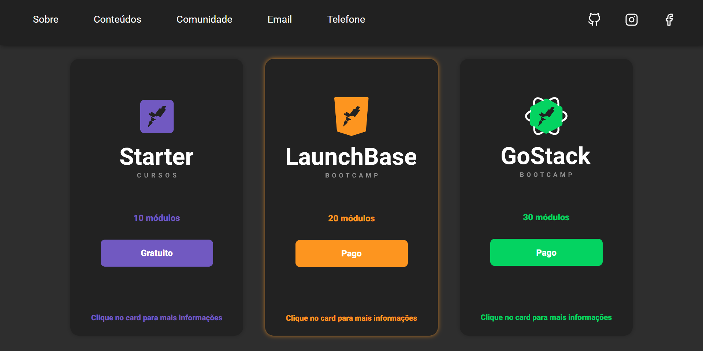

<h1 align="center">
    
</h1>

<h3 align="center">
    Aulas e Desafios Módulo 2 - Iniciando no Front-end
</h3>

<hr>

## ✨ Layout


## ✅ Tasks
 - [x] Desafio 2-1: Primeiro HTML
 - [x] Desafio 2-2: Página de descrição
 - [x] Desafio 2-3: Página de cursos e iframe

## 📓 Aulas e anotações HTML/CSS/JS (Front-end)
 - [Anotações e códigos referentes as aulas de Front-end](https://github.com/pedrofbaltar/aulas-desafios-launchbase-mod2/tree/master/modulo02/aulas-html-css)

## ✏ Desafios HTML/CSS/JS (Front-end)
 - [Desafios resolvidos de Front-end](https://github.com/pedrofbaltar/aulas-desafios-launchbase-mod2/tree/master/modulo02/desafios-html-css)
 
## 🚀 To use this respository
 **1. Clone this repository**
  
 ```
 $ git clone https://github.com/pedrofbaltar/aulas-desafios-launchbase-mod2
 ```

## 📜 Lincença
Esse projeto está sob a licença do MIT. Veja o arquivo [LiCENSE](https://github.com/pedrofbaltar/aulas-desafios-launchbase-mod2/blob/master/LICENSE)

<hr>

Com 💜 [Pedro Felipe Baltar](https://github.com/pedrofbaltar)
